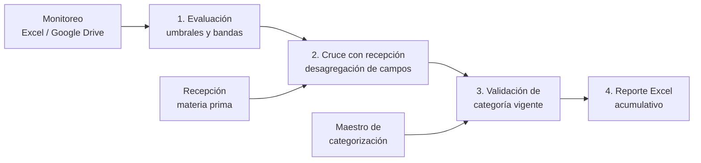

# Pipeline de detección de desviaciones fitosanitarias

Automatización en Python que reemplaza un proceso diario manual en Excel: detecta lotes de proveedores que superan los umbrales de plagas, los cruza con la recepción de materia prima y con la categorización vigente, y genera un reporte listo para compartir.

> Versión pública de un proyecto real. El código original se conecta a sistemas internos de la empresa; aquí esas fuentes se reemplazan por **archivos con datos ficticios** de la misma estructura, para que cualquiera pueda ejecutarlo.

## El problema

Cada día había que:

1. Revisar el monitoreo fitosanitario y marcar los registros que superaban los umbrales (larvas, posturas, picados).
2. Buscar a cada proveedor en el reporte de recepción, donde los campos aparecen desglosados (`C1` en una fuente es `CAMPO 01A` y `CAMPO 01B` en la otra) y los nombres no siempre coinciden (tildes, Ñ, palabras de más).
3. Revisar la categoría vigente de cada campo y decidir cuáles había que actualizar.
4. Armar la tabla final y enviarla.

Todo a mano, cruzando varias hojas de Excel.

## La solución



| Fase | Qué hace |
|---|---|
| **1. Evaluación** | Filtra por fecha y tipo de campo, suma posturas y compara cada indicador contra su umbral configurable. Soporta bandas intermedias con categoría propia (ej. posturas entre 2 % y 3.3 % → categoría 2). Si un registro supera varios indicadores, se queda con el de mayor exceso. |
| **2. Cruce** | Normaliza nombres (mayúsculas, sin tildes, Ñ→N) y códigos de campo (`CAMPO 04A` → `C4A`). Reemplaza campos genéricos por sus variantes reales y avisa cuando un proveedor no aparece, sugiriendo nombres parecidos para detectar errores de digitación. |
| **3. Categorización** | Busca la vigencia que cubre la fecha, ignora rangos de un solo día y excluye campos que ya están en categoría 5, 6 o 7. Marca cada fila como `CATEGORIZADO`, `SIN CATEGORÍA` (vigencia vencida) o `SIN REGISTRO`. |
| **4. Reporte** | Excel con una hoja por etapa (trazabilidad completa), formato, filtros y encabezados fijos. Es acumulativo: cada corrida agrega sus filas sin duplicar las anteriores. |

## Resultado

<!-- Completa con tus números reales -->
- El proceso pasó de **1 hora manual** a **5 minutos** por día.
- Se eliminaron errores de cruce por nombres y campos escritos distinto entre sistemas.

## Cómo ejecutarlo

```bash
git clone https://github.com/JohanCh01/pipeline-desviaciones-fitosanitarias.git
cd pipeline-desviaciones-fitosanitarias
pip install -r requirements.txt

python datos/generar_datos_ejemplo.py   # crea los datos ficticios
python main.py                          # genera salida/reporte_desviaciones.xlsx
python -m pytest                        # corre las pruebas
```

Otra fecha: `python main.py --fecha 14/09/2026`

Los umbrales, bandas, correcciones de nombres y rutas se ajustan en `config.json`, sin tocar el código.

### Descarga desde Google Drive (opcional)

`python main.py --drive` descarga el monitoreo con la API de Google Drive usando una cuenta de servicio de solo lectura. El ID del archivo y la ruta de las credenciales se leen de variables de entorno (ver `.env.example`); nunca están en el código.

## Estructura

```
├── main.py                    # orquesta las 4 fases
├── config.json                # umbrales, bandas y rutas
├── pipeline/
│   ├── texto.py               # normalización de nombres y campos
│   ├── evaluacion.py          # fase 1
│   ├── cruce.py               # fase 2
│   ├── categorizacion.py      # fase 3
│   ├── reporte.py             # fase 4
│   └── fuentes.py             # descarga desde Google Drive
├── datos/
│   └── generar_datos_ejemplo.py
└── tests/
    └── test_pipeline.py
```

## Tecnologías

Python · pandas · openpyxl · Google Drive API · pytest

En la versión productiva, además: Selenium para extraer datos de sistemas web internos, envío automático del resumen por WhatsApp (API REST) y notificaciones push para aprobar pasos críticos.
